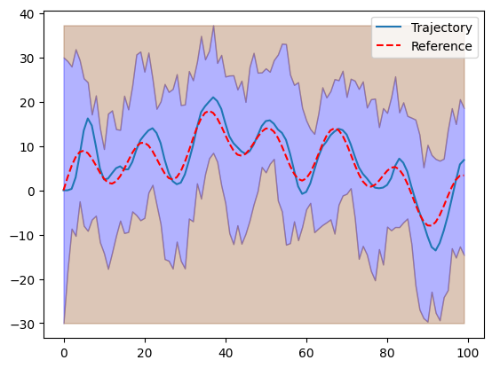

# Practical Report: UUV Mission

*Checkout the Github Repo Here*: [link](https://github.com/AnyuShan2024/b1-coding-practical-mt24)

## a) Background and Motivation

The control system for the uncrewed underwater vehicle (UUV) is completed, including mission data input and the controller setup.

## b) Changes to Codebase

The following changes were made to the codebase (listed chronologically):

- **dynamic.py**: Updated the _from_csv()_ method of the _Mission_ class to:
    - Handle file paths using the _os_ package
    - Extract data using the _pandas_ package
- **control.py**: Created to modularize controller classes:
    - **Controller** (parent class):
        - Defines the method _compute_action()_ returning a float
    - **PDController** (child class):
        - Initializes with $K_P$ and $K_D$
        - Implements PD control in _compute_action()_
- **dynamic.py**: Updated the _ClosedLoop_ class:
    - Accepts a _Controller_ instance on initialization
    - Evaluates controller action in the _simulate()_ method

## c) Justification of Design Choices

The class-based design with inheritance was chosen for:

- **Modularity**: Easily extendable by adding new controllers.
- **Parameter management**: Controller parameters are managed within individual classes.
- **Code clarity**: The structure minimizes repetition and enhances readability.

## d) Difficulties Encountered

- **Issue**: Virtual environment was mistakenly included in GIT.
    - **Solution**: Restarted early and added _"venv/"_ to _.gitignore_.
- **Issue**: Jupyter Notebook didn't recognize the local package _uuv-mission_.
    - **Solution**: Installed _uuv-mission_ in the virtual environment.

## e) Possible Improvements

- **UUV Safety Feature**: The PD controller only follows the reference.
    - **Suggestion**: Clamp controller action near height or depth limits to prevent collisions.
- **Limited DOF**: Only vertical motion is controlled.
	- **Suggestion**: Implement a state-space approach to manage both depth and horizontal positioning.

## Attachment: Screenshot of Simulation Result

